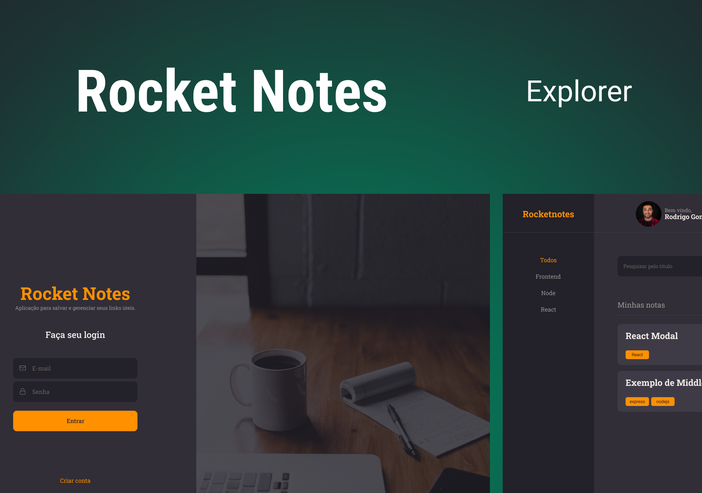

# Rocket Notes

Desenvolvimento do projeto Rocket Notes, aplicação que cria notas, utilizando a biblioteca React.

## 🚀 Tecnologias

Esse projeto foi desenvolvido com as seguintes tecnologias:

- HTML
- CSS
- JavaScript
- React
- Vite
- Styled Components
- Axios

## 💻 Projeto

Página web na qual o usuário pode criar e ver suas notas, assim como excluí-las.

- [Acesse o projeto finalizado, online](https://rocketnotes-brunobrsl.netlify.app)

## 🔗 Links
